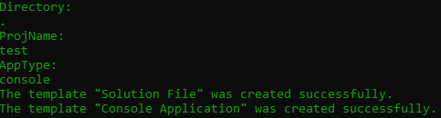

# Automate .Net Project Creation

Creates a new .Net project using a batch script

## How to use

In order to use, from your powershell or command line, run the following:

```ps
.\create_new_project.bat
```

You will be prompted to enter the directory which you want to have your project in. This directory must be created before using. If you want to use the current directory, you can use a "."

Then you will enter the name of your project. This will be where your project files are located. You wil then be prompted to enter the App type. The app type will be the kind of app you are creating such as a console application.



In the background, your project will create a solution file in the directory you entered earlier. Then a new app will be created based on what is entered.

Finally, the project will be added to the solution file.

## Notes

1. This program assumes that you have the dotnet SDK installed on your machine.
2. Your operating system is Windows.
3. Before running, make sure all neccessary packages are installed.

## Features to be added

1. Specifying the language you want to use (C#, F#, VBA, etc.) when creating a new project.
2. If a template is not installed, allow for the user to install it.
